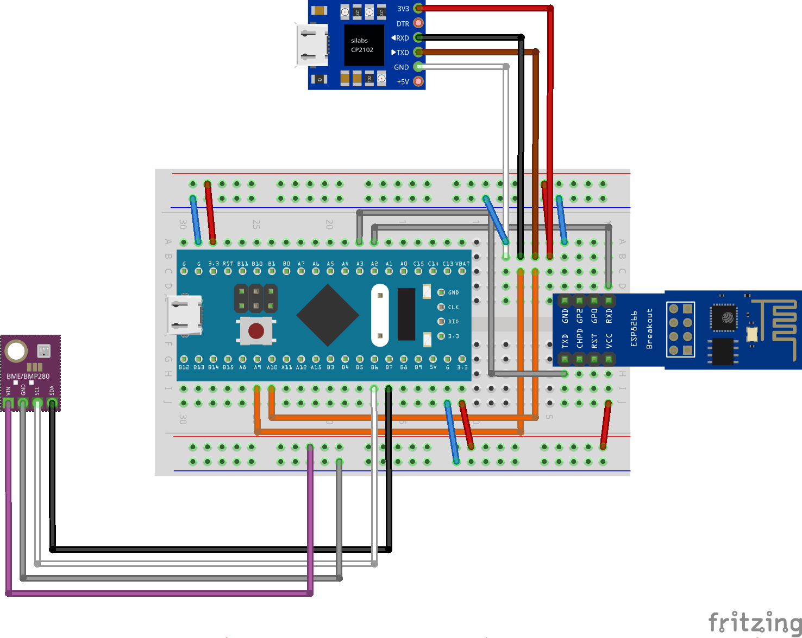
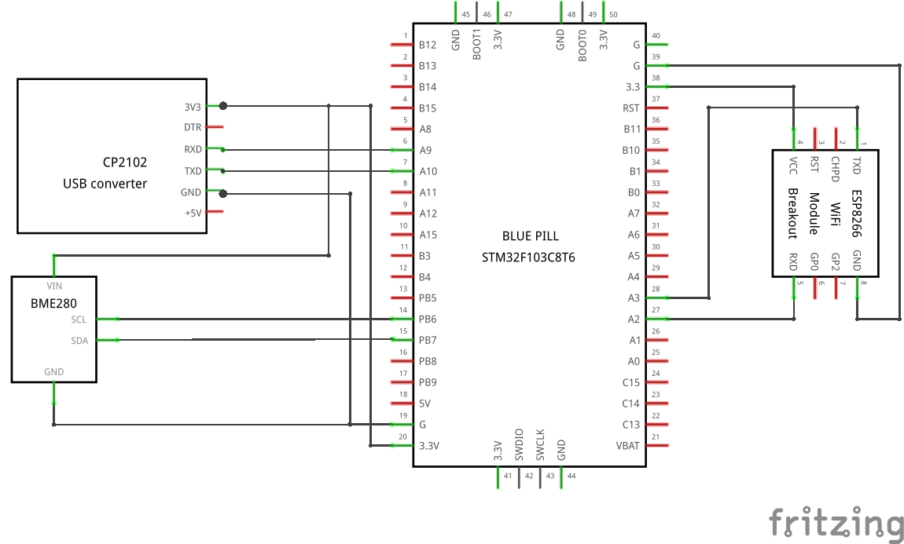

# STM32 testing bench with PlatformIO

The aim of this project is to build a test environment based on STM32 microcontroller platforms like the "Bluepill F103C8", the "Nucleo64 F103RB" and the "Maple mini clone" from Baite with the use of PlatformIO and the Arduino framework. So a very important goal is to write the code as portable as possible with many defines.

The onboard LED is flashing like a heartbeat to show all things are "alive". This function is implemented as an finite state machine (FSM) and in an non-blocking manner without delay() functions.

For the purpose of a STM32 test environment, some peripheral sensor modules are planned to integrate like the Bosch BME280 (temperature, humidity and pressure).

STM32 microcontroller don't have any networking interfaces on board like ethernet, wifi or bluetooth. For this reason the most important goal is to integrate a suitably wifi interface. One possibility is to connect a small ESP8266-01 microcontroller via the second hardware serial line Serial2(PA3, PA2) driven with with baud rate of 115200 bps. The challange is, that the vendor fimware of the ESP8266-01 microcontroller communicates over an AT protocol only. Furthermore, some of the AT commands seem not to work like described in the manuals ... (e. g. setting the hostname).

With an established network connection it is possible to implement higher level functionality like a webserver to display the sensor data. An other possibility is to transfer the sensor data via network protocols like MQTT to a NodeRed server.

## Visual impressions

Coming soon.

## Bill of materials (BOM)

Following parts I have used in this project:

- **Bluepill** board (with STM32F103C8T6 ARM3 microcontroller)
- ESP8266-01 (as wifi adapter); flashed with original fimware (AT commands are used)
- breadboard adapter for ESP8266-01
- USB-to-serial adapter (chipsets like CP2102 or CH340G are suitable); important: only use the 3.3 V VCC lines!
- USB cable (which one depends on the port of the USB-to-serial adapter)
- BME280 (temperature, humidity and pressure sensor)
- breadboard half+ (400 holes)
- wire jumpers

## Breadboard layout and schematics

With *Fritzing* (https://fritzing.org) I have created following breadboard layout:

The schematics looks like this:

## Software libraries and documentation

Coming soon.

## License

This project is licensed under the terms of "GNU General Public License v3.0". For details see [LICENSE](LICENSE).

## Implemented functionality

- onboard LED is flashing like heartbeat; implemented in an FSM
- sensor module Bosch BME280 (temperature, humidity and pressure) is read via I2C line and written to the serial console
- wifi connection is established with a ESP8266-01 microcontroller via 2. hardware serial line
- webserver shows a very basic html website with the time passed since last reboot

## Todo and known issues

[Todo 2020-03-31] Establishing the wifi connection is very slow and not very reliable. It has to be rewritten in an finite state machine (FSM).

[Todo 2020-03-31] Sensor data of the BME280 should be displayed on the webserver.

[Issue 2020-03-31] Webserver responses are very unstable and unreliable. Eliminate of delay() functions and rewrite in an non-blocking manner.

<!--  -->
